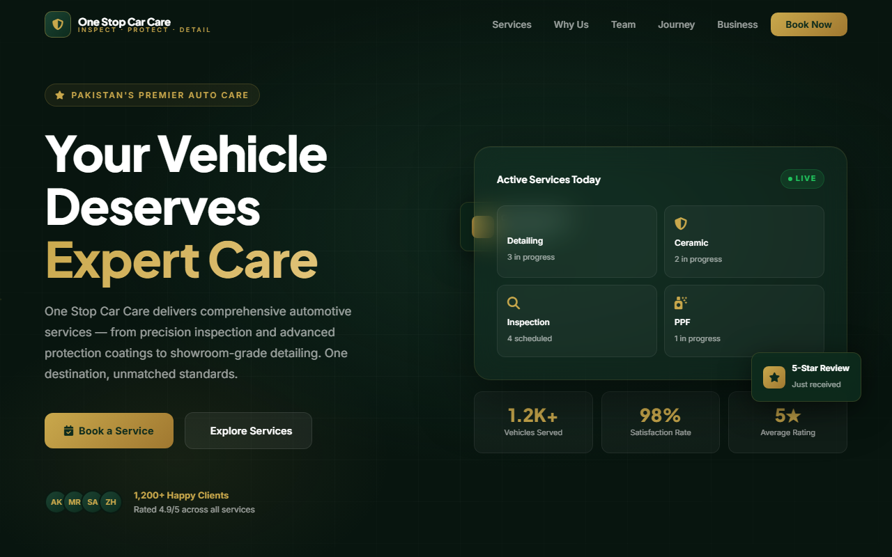
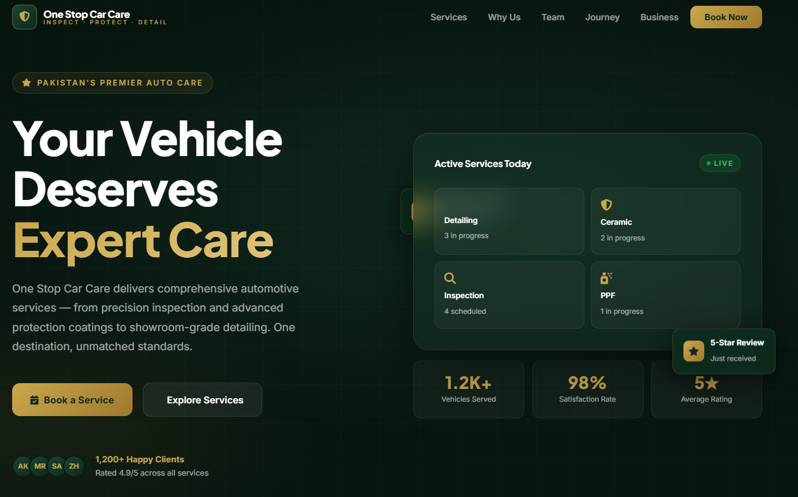
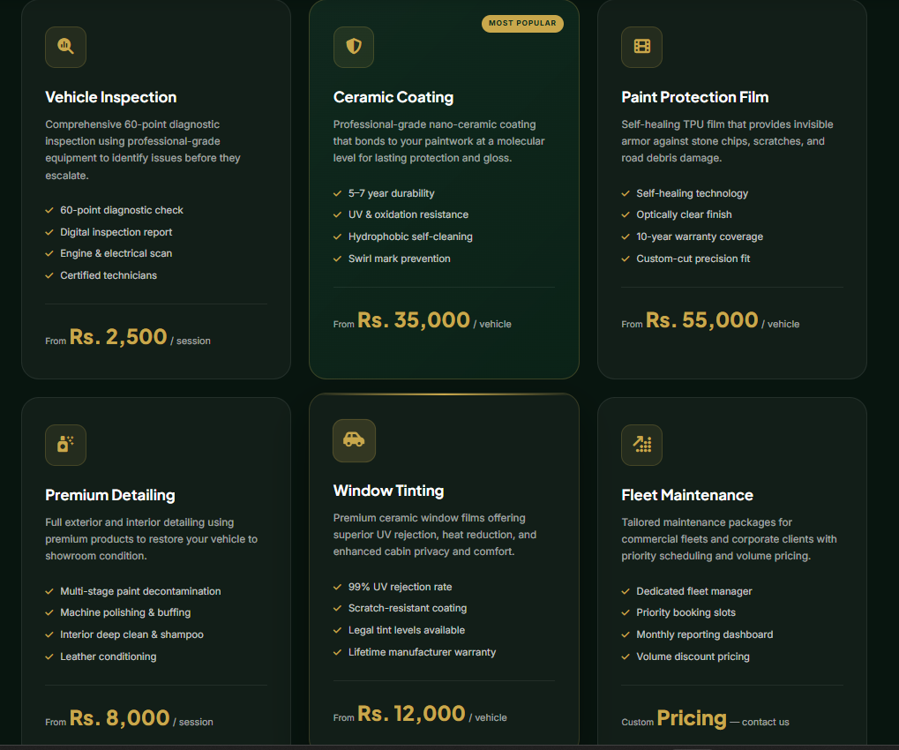
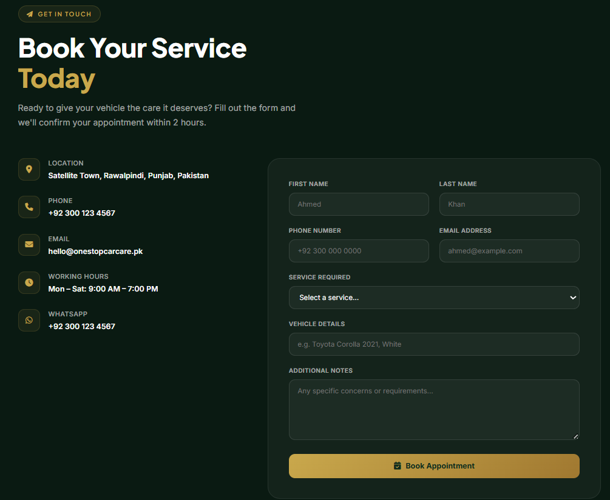

# 🚀 One Stop Car Care Website

**Single-file static website (HTML/CSS/JS) for One Stop Car Care. Mobile-first layout, responsive sections, WhatsApp booking flow with prefilled messages, and deployable GitHub Pages setup.**

Documented · MIT licensed · Maintained

---

## Screenshots

## 🐍 Contribution graph

<picture>
  <source media="(prefers-color-scheme: dark)" srcset="https://raw.githubusercontent.com/mafzalkalwardev/one-stop-car-care-website/output/snake-dark.svg" />
  <source media="(prefers-color-scheme: light)" srcset="https://raw.githubusercontent.com/mafzalkalwardev/one-stop-car-care-website/output/snake.svg" />
  
</picture>

---

 

**Doorstep Car Care** with inspection reports, detailing, PPF, and complete washes — done at your home or office.

---

## ✅ Features

- 🧼 **Complete Car Wash** (Interior + Exterior + Engine Bay + more)
- ✨ **Detailing / Deep Clean** (Clay, polish, wax, odor removal)
- 🛡️ **PPF – Paint Protection Film** (Scratch & stone-chip protection)
- 🔧 **Car Inspection** (Detailed written reports)
- 🤝 **Used Car Package** (Inspection + detailing + wash)
- ⚡ **Fast response**: confirmation within ~30 minutes
- 🏠 **Doorstep service**: no need to visit a workshop

---

## 📌 Services & Pricing (Quick View)

- **Complete Car Wash**: Rs **800–1,500**
- **Detailing (Deep Clean)**: Rs **5,000–15,000**
- **PPF**: Rs **30,000–80,000**
- **Car Inspection**: Rs **1,000–2,000**
- **Used Car Package**: Rs **8,000–20,000**

> Final price depends on the vehicle condition and your selected package.

---

## 🧭 How It Works (6 Steps)

1. 📞 Call / WhatsApp us
2. ✅ Choose your service
3. 🧰 We come to your door
4. 🧼 Service is done on the spot
5. 💳 Pay online or cash
6. 🚘 Drive away happy ✓

---

## 📲 Book a Service

WhatsApp booking link:
- **wa.me/923079670503**

On the website, click **“Book on WhatsApp”** to send your request with service details.

---

### Key Screens

- 🏠 Hero / Landing Section (Doorstep car care headline)
- ✅ Services Cards (Wash, Detailing, PPF, Inspection, Used Car Package)
- 🧭 How-It-Works (6-step process)
- 📅 Booking Form (WhatsApp prefilled request flow)

Example:
- ![Hero Screenshot] 
- ![Services Screenshot]
- ![Booking Screenshot]
## ▶️ Run Locally

Since this is a static site (single-page HTML):

1. Open `index.html` in your browser.
2. Or use any static server (optional).

---

## 🔗 Contact

- WhatsApp: **0300-1234567**
- Email: **info@onestopcarcare.pk**
- Area: **Rawalpindi & Islamabad**

---

## 📄 Notes

- This project is front-end only (HTML/CSS/JS in `index.html`).
- WhatsApp messages are generated from the booking form automatically.
